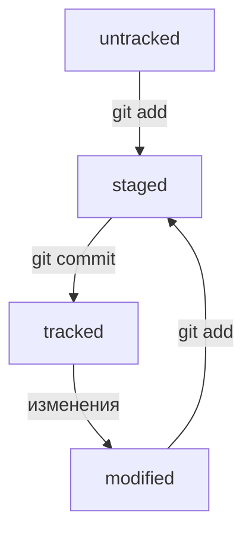

Бесплатные курсы. 
Материал ниже в том числе является интерпритацией или копией этих курсов. 

- Яндекс.Практикум. [Бесплатный курс - Основы работы с Git](https://practicum.yandex.ru/git-basics/?from=catalog)
- Хекслет. [Введение в Git](https://ru.hexlet.io/courses/intro_to_git)


GIT - система контроля версий.  VCS  - version control system 
или SCM -  source control managment

Git и GitHub — это два разных проекта, которые развиваются независимо друг от друга.

Git: - консольный инструмент для работы с локальными и удалёнными репозиториями; - проект с открытым исходным кодом.

GitHub: - платформа для размещения удалённых репозиториев; - принадлежит компании Microsoft.

Премущества:
- Контроль -  кто что когда где зачем 
- Безопасные изменения - вытекает из первого
- Возможность восстановить - можно откатиться на старую версию, и еще и оставить проблемную в одтельном месте для испрвлений
- Командная  работа - можно одновременно вести разработку и помещать изменения сообща 

Основные функции:
- хранение истории изменений
- манипуляция историей: изменение порядка ревизий, удаление версий, возвращение назад в истории
- анализ изменений: кто, что, когда и как часто вносил

 По большей части Git движется «только вперед». Правильный подход при работе с ним — это создавать новое, а не изменять старое. 


 # Команды терминала Bash  УТАЩИ В ОТДЕЛЬНОЕ МЕСТО В БАШ

`git version` - версия ГИТ. Если версия есть все хорошо, если версии нет - нужно поставить - см. Гугл )

`git confing -- global user.name` 123 задать имя
`git confing -- global user.email` 123@123.com задать почту 
`git confing -- list`  - посмотреть запись в конфиге
git init -  инициализация Git репозитория там где вы находитесь в тукущий момент и начнет отслеживать все изменения. Так же создаст скрытую папку git - системаная штука 
"разгитить папку" - просто удили папку .git rm -rf 
git status -  проверить состояние репозитория

`s3d0y@s3d0y-VM:~/Documents/GitCheatSheet$ git status` 
`On branch main` название текущей ветки
`Your branch is up to date with 'origin/main'.`

`Changes not staged for commit:` - изменения не на сцене
  `(use "git add <file>..." to update what will be committed)`
  `(use "git restore <file>..." to discard changes in working directory)`
	`modified:   README.md` - файлы которые менялись 

`no changes added to commit (use "git add" and/or "git commit -a")`- на комит ничего не добавлено 
`s3d0y@s3d0y-VM:~/Documents/GitCheatSheet$ ``

`git clean -fd`  - удалит файлы и директории которые были созданы, но еще не добавленый в  stage  через add.  Даже после `add .` пустая папка была removing. Аккуратнее с этим ) 

git add --all  добавить на сцену - подготовить к комиту. 
git commit -m 'coment'
git log - посмотреть историю комитов 
git log --oneline - сокращенный лог
git remote add - 
Откройте консоль, перейдите в каталог локального репозитория и введите команду `git remote add` (от англ. _remote_ — «удалённый» и _add_ — «добавить»).

```
$ cd ~/dev/first-project
$ git remote add origin git@github.com:%ИМЯ_АККАУНТА%/first-project.git 
```

Команде необходимо передать два параметра: имя удалённого репозитория и его URL. В качестве имени используйте слово `origin`. А URL вы скопировали со страницы удалённого репозитория.
git remote -v Флаг `-v` — короткая форма флага `--verbose` (англ. «подробный»). Он позволяет показать больше информации в выводе.
git push - толкнуть на удаленный репозиторий 
git commit --amend - работает только с последним комитом HEAD

# Шпаргалка. Базовые команды в консоли (Command Line Interface)

Чтобы вам было удобнее взаимодействовать с командной строкой, мы подготовили шпаргалку. В ней собраны все команды, о которых мы рассказали в уроках, и их полезные вариации.

### Помощь
- `man`   — manual. Совместно с именем команды выведет инструкуцию. Например `man ls` 

### Навигация

- `pwd` (от англ. _**p**rint **w**orking **d**irectory_, «показать рабочую папку») — покажи, в какой я папке;
- `ls` (от англ. _**l**i**s**t directory contents_, «отобразить содержимое директории») — покажи файлы и папки в текущей папке; 
- `ls -a` — покажи также скрытые файлы и папки, названия которых начинаются с символа `.`;
- `ls -l` —  вывод подробной информации о содержимом каталога в виде списка;
- `ls -  al` —  сразу два ключа. так тоже можно
- `cd first-project` (от англ. _**c**hange **d**irectory_, «сменить директорию») — перейди в папку `first-project`;
- `cd first-project/html` — перейди в папку `html`, которая находится в папке `first-project`;
- `cd ..` — перейди на уровень выше, в родительскую папку;
- `cd ~` — перейди в домашнюю директорию (`/Users/Username`);
- `cd /` — перейди в корневую директорию.

### Работа с файлами и папками

**Создание**

- `touch index.html` (англ. _touch,_ «коснуться») — создай файл `index.html` в текущей папке;
- `touch index.html style.css script.js` — если нужно создать сразу несколько файлов, можно напечатать их имена в одну строку через пробел;
- `mkdir second-project` (от англ. _**m**a**k**e **dir**ectory_, «создать директорию») — создай папку с именем `second-project` в текущей папке.

**Копирование и перемещение**

- `cp file.txt ~/my-dir` (от англ. _**c**o**p**y_, «копировать») — скопируй файл в другое место;
- `mv file.txt ~/my-dir` (от англ. _**m**o**v**e_, «переместить») — перемести файл или папку в другое место.

**Чтение**

- `cat file.txt` (от англ. _con**cat**enate and print_, «объединить и распечатать») — распечатай содержимое текстового файла `file.txt`.

**Удаление**

- `rm about.html` (от англ. _**r**e**m**ove_, «удалить») — удали файл `about.html`;
- `rmdir images` (от англ. _**r**e**m**ove **dir**ectory_, «удалить директорию») — удали папку `images`;
- `rm -rf second-project` (от англ. _**r**e**m**ove,_ «удалить» + _**r**ecursive_, «рекурсивный» + **f**orce, "силой/заставить/принудить" ) — удали папку `second-project` и всё, что она содержит.


### Полезные возможности

- Команды необязательно печатать и выполнять по очереди. Можно указать их списком — разделить двумя амперсандами (`&&`).
- У консоли есть собственная память — буфер с несколькими последними командами. По ним можно перемещаться с помощью клавиш со стрелками вверх (**`↑`**) и вниз (**`↓`**).
- Чтобы не вводить название файла или папки полностью, можно набрать первые символы имени и дважды нажать `Tab`. Если файл или папка есть в текущей директории, командная строка допишет путь сама.
    
    Например, вы находитесь в папке `dev`. Начните вводить `cd first` и дважды нажмите `Tab`. Если папка `first-project` есть внутри `dev`, командная строка автоматически подставит её имя. Останется только нажать `Enter`.


# Шпаргалка. Начало работы с Git

Чтобы вам было проще запомнить все команды, о которых шла речь в этом модуле, мы собрали их в одном месте.

### Инициализация репозитория

`git init` (от англ. _**init**ialize_, «инициализировать») — инициализируй репозиторий.

### Синхронизация локального и удалённого репозиториев

`git remote add origin https://github.com/YandexPracticum/first-project.git` (от англ. _remote_, «удалённый» + _add,_ «добавить») — привяжи локальный репозиторий к удалённому с URL `https://github.com/YandexPracticum/first-project.git`;

`git remote -v` (от англ. _**v**erbose_, «подробный») — проверь, что репозитории действительно связались;

`git push -u origin main` (от англ. _push_, «толкать») — в первый раз загрузи все коммиты из локального репозитория в удалённый с названием `origin`.

💡 Ваша ветка может называться `master`, а не `main`. Подправьте команду, если это необходимо.

`git push` (от англ. _push_, «толкать») — загрузи коммиты в удалённый репозиторий после того, как он был привязан с помощью флага `-u`.

### Подготовка файла к коммиту

`git add todo.txt` (от англ. _add_, «добавить») — подготовь файл `todo.txt` к коммиту;

`git add --all` (от англ. _add_, «добавить» + _all_, «всё») — подготовь к коммиту сразу все файлы, в которых были изменения, и все новые файлы;

`git add .` — подготовь к коммиту текущую папку и все файлы в ней.

### Создание и публикация коммита

`git commit -m "Комментарий к коммиту."` (от англ. _commit,_ «совершать», фиксировать» + _**m**essage,_ «сообщение») — сделай коммит и оставь комментарий, чтобы было проще понять, какие изменения сделаны;

`git push` (от англ. _push_, «толкать») — добавь изменения в удалённый репозиторий.

### Просмотр информации о коммитах

`git log` (от англ. _log_, «журнал [записей]») — выведи подробную историю коммитов;

`git log --oneline` (от англ. _log_, «журнал [записей]» + _oneline_, «одной строкой») — покажи краткую информацию о коммитах: сокращённый хеш и сообщение.

`--graph` - с этим флагом рисует Git нарисует ветки с помощью «палочек» и «звёздочек»

`-p` - с этим флагом слелает лог с diff  (изменениями)

 `git show хэш комита` - покажет diff указанного коммита и предыдущего
 
 `git blame имя файла` - покажет кто и когда вносил изменения в файл
 
 `git grep строка` - ищет совпадения со строкой во всех файлах проекта

### Просмотр состояния файлов

`git status` (от англ. _status_, «статус», «состояние») — покажи текущее состояние репозитория.

### Добавление изменений в последний коммит

`git commit --amend --no-edit` (от англ. _amend_, «исправить») — добавь изменения к последнему коммиту и оставь сообщение прежним;

`git commit --amend -m "Новое сообщение"` — измени сообщение к последнему коммиту на `Новое сообщение`.

💡 Выйти из редактора Vim: нажать `Esc`, ввести `:qa!`, нажать `Enter`.

### «Откат» файлов и коммитов

`git restore --staged hello.txt` (от англ. _restore_, «восстановить») — переведи файл `hello.txt` из состояния `staged` обратно в `untracked` или `modified`;

`git restore hello.txt` — верни файл `hello.txt` к последней версии, которая была сохранена через `git commit` или `git add`; (верни = по сути удалить все что было не add)

`git reset --hard b576d89` (от англ. _reset_, «сброс», «обнуление» + _hard_, «суровый») — удали все незакоммиченные изменения из staging и «рабочей зоны» вплоть до указанного коммита.

`git revert хэш комита` - фактически это созданию еще одного коммита, который выполняет изменения, противоположные тому коммиту, который отменяется. Vожет отменять не только последний коммит, но и любой другой коммит из истории проекта. 

``` bash
# Этой команде нужен идентификатор коммита
# Это коммит, которым мы удалили файл PEOPLE.md
git revert aa600a43cb164408e4ad87d216bc679d097f1a6c
# После этой команды откроется редактор, ожидающий ввода описания коммита
# Обычно сообщение revert не меняют, поэтому достаточно просто закрыть редактор
[main 65a8ef7] Revert "remove PEOPLE.md"
 1 file changed, 1 insertion(+)
 create mode 100644 PEOPLE.md
# В проект вернулся файл PEOPLE.md

git log -p

commit 65a8ef7fd56c7356dcee35c2d05b4400f4467ca8
Author: tirion <tirion@got.com>
Date:   Sat Sep 26 15:32:46 2020 -0400

    Revert "remove PEOPLE.md"

    This reverts commit aa600a43cb164408e4ad87d216bc679d097f1a6c.

diff --git a/PEOPLE.md b/PEOPLE.md
new file mode 100644
index 0000000..4b34ba8
--- /dev/null
+++ b/PEOPLE.md
@@ -0,0 +1 @@
+Haskell Curry
```

### Просмотр изменений

`git diff` (от англ. _**diff**erence_, «отличие», «разница») — покажи изменения в «рабочей зоне», то есть в `modified`-файлах;

`git diff a9928ab 11bada1` — выведи разницу между двумя коммитами;

`git diff --staged` — покажи изменения, которые добавлены в `staged`-файлах.

Вы с нами уже два модуля и наверняка успели составить некоторое впечатление о курсе. Надеемся, что вам с нами интересно!


# Шпаргалка. Работа с ветками

В этой шпаргалке мы собрали все ключевые команды модуля — они наверняка пригодятся вам в реальной работе с ветками!

### Клонирование чужого репозитория

`git clone git@github.com:YandexPraktikum/first-project.git` (от англ. _clone_, «клон», «копия») — склонируй репозиторий с URL `first-project.git` из аккаунта `YandexPraktikum` на мой локальный компьютер.

### Создание веток

`git branch feature/the-finest-branch` (от англ. _branch_, «ветка») — создай ветку от текущей с названием `feature/the-finest-branch`;

`git checkout -b feature/the-finest-branch` — создай ветку `feature/the-finest-branch` и сразу переключись на неё.

### Навигация по веткам

`git branch` (от англ. _branch_, «ветка») — покажи, какие есть ветки в репозитории и в какой из них я нахожусь (текущая ветка будет отмечена символом `*`);

`git branch -a` — покажи все известные ветки, как локальные (в локальном репозитории), так и удалённые (в `origin`, или на GitHub).

`git checkout feature/br` — переключись на ветку `feature/br`.

### Сравнение веток

`git diff main HEAD` (от англ. _**diff**erence_, «отличие», «разница») — покажи разницу между веткой `main` и указателем на `HEAD`;

`git diff HEAD~2 HEAD` — покажи разницу между тем коммитом, который был два коммита назад, и текущим.

### Удаление веток

`git branch -d br-name` — удали ветку `br-name`, но только если она является частью `main`;

`git branch -D br-name` — удали ветку `br-name`, даже если она не объединена с `main`.

### Слияние веток

`git merge main` (от англ. _merge_, «сливать», «поглощать») — объедини ветку `main` с текущей активной веткой.

### Работа с удалённым репозиторием

`git push -u origin my-branch` (от англ. _push_, «толкнуть», «протолкнуть») — отправь новую ветку `my-branch` в удалённый репозиторий и свяжи локальную ветку с удалённой, чтобы при дополнительных коммитах можно было писать просто `git push` без `-u`;

`git push my-branch` — отправь дополнительные изменения в ветку `my-branch`, которая уже существует в удалённом репозитории;

`git pull` (от англ. _pull_, «вытянуть») — подтяни изменения текущей ветки из удалённого репозитория.

Вы уже преодолели половину курса. Надеемся, что вам с нами интересно!

---
# Шпаргалка. Командная работа в Git

Модуль подошёл к концу, а это значит, что пришло время подвести итоги и запастись шпаргалкой!

### Feature branch workflow

Самый популярный подход к работе с Git в команде — это feature branch workflow. В нём создают ветку для каждой задачи (например, для новой функциональности или исправления бага), а когда всё готово, вливают новую ветку в `main`.

Важные этапы этого процесса — пул-реквест и ревью изменений. Пул-реквест — это интерфейс, в котором можно обсудить изменения. Ревью — просмотр изменений другими участниками и один из способов проверить качество таких изменений.

Если вы уже участник проекта (или collaborator в терминах GitHub), можно клонировать репозиторий напрямую. А если нет, нужно предварительно сделать «форк». Также для участников доступна кнопка **Merge** после ревью, а для неучастников — нет.

### Конфликты слияния

Когда один и тот же файл меняется в нескольких ветках, при их слиянии может произойти конфликт. Пугаться конфликтов не нужно, это нормальная часть работы с системами контроля версий. IDE, вроде VSCode или Intellij IDEA, помогут «склеить» файл из двух конфликтующих версий.

### Алгоритм-шпаргалка для создания PR

1. Склонировать репозиторий.
    
    1. Если вы не участник проекта, предварительно сделать «форк» исходного репозитория.
    2. На странице репозитория или «форка» нажать кнопки: **Code → SSH → скопировать ссылку**.
    3. Выполнить команду `git clone <ссылка на репозиторий>`.
2. Создать ветку для вашей задачи: `git checkout -b my-task-branch-name`.
3. Добавить и «закоммитить» изменения, которые вы хотите внести в проект.
4. «Запушить» ветку: `git push --set-upstream origin HEAD` или `git push -u origin my-task-branch-name`.
    
    1. GitHub (с помощью Git) выведет ссылку на создание PR. По ней нужно перейти.
    2. PR можно также создать через интерфейс GitHub.
5. Сообщить о пул-реквесте ревьюеру.
    
    1. Иногда ревьюеры назначаются автоматически, тогда сообщать не нужно.
6. Обсуждать с ревьюером предлагаемые изменения и вносить правки, пока эти изменения не будут одобрены (пока не будет получен «апрув»).
    
    6.1. Если кто-то добавил конфликтующие изменения в `main`, пока ваш PR был на ревью, нужно разрешить конфликт:
    
    - Обновить `main`: `git checkout main && git pull`.
    - Влить `main` в свою ветку: `git checkout my-task-branch-name && git merge main`.
    - Разрешить конфликты слияния с помощью IDE или вручную.
    - Создать коммит слияния: `git commit --no-edit` или `git commit -m 'merge main'`.
    - Сделать `git push` своей ветки.
7. Нажать кнопку **Merge** или подождать, пока её нажмёт кто-то ещё.
8. Ещё раз обновить `main`, чтобы «подтянуть» ваши изменения в основную ветку локального репозитория: `git checkout main && git pull`.
9. Вы великолепны! Можете начинать снова со второго пункта.

### Алгоритм-шпаргалка для разрешения конфликтов слияния

1. Открыть проект в IDE (VS Code, IDEA или другие).
2. Открыть файл, в котором есть конфликт.
3. Выбрать, какие части файла нужно взять из одной ветки, а какие — из другой.
4. Когда конфликты разрешены, сделать коммит: `git commit --no-edit` или `git commit -m 'merge branch <название ветки>'`.

Готово! Теперь вы можете приступать к работе над реальным проектом. Git будет вашим новым союзником!

💡 Модуль дополняется. Напишите, о чём ещё хотели бы узнать, в форме обратной связи — в разделе «Какие вопросы по теме модуля у вас остались?». Следите за обновлениями — будет много интересного!

# SSH (шифрование)

Когда компьютеры обмениваются данными в сети, они следуют **сетевым протоколам** (англ. _network protocols_) — правилам обмена данными между компьютерами.

Один из наиболее распространённых сетевых протоколов — **SSH** (от англ. _**S**ecure **Sh**ell Protocol_). Он обеспечивает безопасный обмен данными в сети. С помощью этого протокола можно получать данные с удалённого компьютера или отправлять их на него. Трафик шифруется, поэтому протокол безопасен.

SSH использует пару ключей для обеспечения безопасности — публичный и приватный:

- **Приватный ключ** (англ. _private key_) хранится только на вашем компьютере и не должен передаваться кому-либо ещё. Он используется для расшифровки данных.
- **Публичный ключ** (англ. _public key_) доступен всем и используется для шифрования данных. Они могут быть расшифрованы парным приватным ключом.

Только вы можете расшифровать данные с помощью приватного ключа, но любой владелец публичного ключа может их для вас зашифровать. Эти два ключа связаны и образуют **SSH-пару**. В будущем вы наверняка будете использовать их для взаимодействия с GitHub и другими удалёнными серверами.

[Подробнее см в курсе](https://practicum.yandex.ru/trainer/git-basics/lesson/42435683-0922-4231-bfb4-d7d32d61f50a/)

# Markdown 

[Шпаргалка по Маркадаун](https://gist.github.com/fomvasss/8dd8cd7f88c67a4e3727f9d39224a84c)


# Хеш — идентификатор коммита
**Хеширование** (от англ. _hash_, «рубить», «крошить», «мешанина») — это способ преобразовать набор данных и получить их «отпечаток» (англ. _fingerprint_).

- если хеш получить дважды для одного и того же набора входных данных, то результат будет гарантированно одинаковый;
- если хоть что-то в исходных данных поменяется (хотя бы один символ), то хеш тоже изменится (причём сильно).

Git хранит таблицу соответствий `хеш → информация о коммите`. Если вы знаете хеш, вы можете узнать всё остальное: автора и дату коммита и содержимое закоммиченных файлов. Можно сказать, что хеш — основной идентификатор коммита.

При работе с Git хеши будут встречаться вам регулярно. Их можно будет передавать в качестве параметра разным Git-командам, чтобы указать, с каким коммитом нужно произвести то или иное действие.

Все хеши и таблицу `хеш → информация о коммите` Git сохраняет в служебные файлы. Они находятся в скрытой папке `.git` в репозитории проекта.

# Файл HEAD

Файл `HEAD` (англ. «голова», «головной») — один из служебных файлов папки `.git`. Он указывает на коммит, который сделан последним (то есть на самый новый).

В этом можно убедиться с помощью терминала. Перейдите в папку `.git` командой `cd`. Посмотрите содержимое файла `HEAD` командой `cat`.
Внутри `HEAD` — ссылка на служебный файл: `refs/heads/master` (или `refs/heads/main` в зависимости от названия ветки). Если заглянуть в этот файл, можно увидеть хеш последнего коммита.

Когда вы делаете коммит, Git обновляет `refs/heads/master` — записывает в него хеш последнего коммита. Получается, что `HEAD` тоже обновляется, так как ссылается на `refs/heads/master`.

`HEAD` Синоним последнего комита - при работе с Git указатель `HEAD` используется довольно часто. Команды Git принимают в качестве параметра хеш коммита. Если нужно передать последний коммит, то вместо его хеша можно просто написать слово `HEAD` — Git поймёт, что вы имели в виду последний коммит.

# Статусы файлов в Git

-  `untracked` - новые файлы в Git-репозитории помечаются как `untracked`, то есть неотслеживаемые. Git «видит», что такой файл существует, но не следит за изменениями в нём. У `untracked`-файла нет предыдущих версий, зафиксированных в коммитах или через команду `git add`

-  `tracked`- Состояние `tracked` — это противоположность `untracked`. Оно довольно широкое по смыслу: в него попадают файлы, которые уже были зафиксированы с помощью `git commit`, а также файлы, которые были добавлены в staging area командой `git add`. То есть все файлы, в которых Git так или иначе отслеживает изменения.
  
- `staged` - После выполнения команды `git add` файл попадает в **staging area**, то есть в список файлов, которые войдут в коммит. В этот момент файл находится в состоянии `staged`. В одном из предыдущих уроков мы сравнили коммит с фотографией. Можно развить эту аналогию и сказать, что команда `git add` добавляет персонажей (текущее содержимое файла или нескольких файлов) на **сцену** (англ. _stage_) для общей фотографии, а `git commit` делает снимок всей сцены целиком.

 - `modified` -  `modified` означает, что Git сравнил содержимое файла с последней сохранённой версией и нашёл отличия. Например, файл был закоммичен и после этого изменён.
# Формат описания схем Mermaid


  С языком разметки [Mermaid](https://habr.com/ru/articles/652867/) можно делать любые диграммы! Это очень круто!


Примеры (+ комментарии ):



# Как исправить коммит

В случаях когда необходимо внести изменения в уже сделанный коммит используется опция `amend` (изменить, внести правки): 

`--amend` рассчитан на работу с последним коммитом (`HEAD`)

- `git commit --amend --no-edit`
 `--amend`. Опция  команды `commit`.Новый коммит не создастся, а дополнится последний, просто добавив в него изменения `из stage (после add)`. При этом хеш последнего коммита изменится, потому что изменился список файлов в коммите.
- `--no-edit`.  опция сообщает команде `commit`, что сообщение коммита нужно оставить как было.-
- `git commit --amend -m "Новое сообщение"` - изменить сообщение коммита

# Как откатиться назад, если «всё сломалось»

На разных этапах работы с Git могут происходить похожие ситуации:

- В список на коммит попал лишний файл (например, временный). Нужно «вынуть» его из списка.
- Последние несколько коммитов ошибочные: например, сделали не то, что было нужно, или нарушили логику. Хочется «откатить» сразу несколько коммитов, вернуть «как было вчера».
- Случайно изменился файл, который вообще не должен был меняться. Например, вы открыли не тот файл в редакторе и начали его исправлять.

В этом уроке рассмотрим такие случаи и научим вас «откатывать» нежелательные изменения.

### Выполнить unstage изменений 

 `git restore --staged <file>`

- `git restore --staged example.txt`  - сбросит конкретный файл
- `git restore --staged .`  - сбросит всю текущую папку

### «Откатить» коммит
 `git reset --hard <commit hash>`
 
Иногда нужно «откатить» то, что уже было закоммичено, то есть вернуть состояние репозитория к более раннему. Для этого используют команду `git reset --hard <commit hash>` (от англ. _reset_ — «сброс», «обнуление» и _hard_ — «суровый»).

Будьте осторожны с командой `git reset --hard`! При удалении коммитов можно потерять что-то нужное.
![[Pasted image 20240425125747.png]]

### «Откатить» изменения, которые не попали ни в staging, ни в коммит

`git restore <file>`

Может быть так, что вы случайно изменили файл, который не планировали. Теперь он отображается в `Changes not staged for commit` (`modified`). Чтобы вернуть всё «как было», можно выполнить команду `git restore <file>`.
Изменения в файле «откатятся» до последней версии, которая была сохранена через `git commit` или `git add`.

Как я понял, изменения так же не обратимы. Применять с осторожностью.


# Просматриваем изменения в файлах

При работе с Git часто нужно узнать, что конкретно изменится или уже изменилось после того или иного коммита. Вот примеры таких ситуаций:

- Вы собираетесь сделать коммит, но хотите проверить (или перепроверить), какие именно изменения в него попадут.
- Вчера ваш коллега сделал коммит с сообщением `small fix` (англ. «небольшое исправление»), после чего тесты проекта начали «падать». Чтобы разобраться в ситуации, нужно посмотреть, что изменилось в этом коммите.

Всё это позволяет делать команда `git diff` (от англ. _**diff**erence_ — «отличие», «разница»). 

По умолчанию команда `git diff` не показывает изменения в `staged`-файлах — только в `modified`. Для файлов на сцене используем:

- `git diff --staged`


# Сопоставляем коммиты

`git diff <хэш исходного коммита> <хэш конечного коммита>` 

По сути команда `git diff A B` выводит список инструкций: как превратить состояние `A` в состояние `B`. Если поменять `A` и `B` местами (`git diff B A`), то и инструкции будут обратные: как превратить `B` в `A`. При этом все зелёные строки станут красными, и наоборот.

# Игнорирование файлов в Git

[Целая статья с правилами](https://practicum.yandex.ru/trainer/git-basics/lesson/92ba6ab8-c151-45ad-a0be-ffa4de31c537/)


Часто бывает так, что в папке-репозитории есть файлы, для которых не нужно хранить историю изменений. Например:

- macOS иногда создаёт скрытый файл `.DS_Store` для хранения настроек папки. К вашему проекту он, скорее всего, никакого отношения не имеет.
- В Git не принято коммитить результаты компиляции исходного кода, то есть получившиеся исполняемые файлы.
- Среды разработки (вроде IntelliJ IDEA) могут создавать папку с вашими личными настройками проекта. Если добавить её в репозиторий, то среда разработки других участников проекта может загрузить ваши настройки и начать вести себя странно.

Чтобы Git игнорировал такие файлы и не пытался добавить их в репозиторий, нужно создать файл `.gitignore` (от англ. _ignore_ — «игнорировать») и записать в него названия игнорируемых файлов. В этом уроке разберём, как это сделать.


💡 Правила из `.gitignore` применяются только к новым (`untracked`) файлам. Если файл уже попал в staging area или в коммит, то правила на него не распространяются.

Замечательно! Игнорирование файлов — механизм, который нельзя игнорировать. Вот что важно помнить:

- Если нужно, чтобы Git игнорировал какие-то файлы, стоит составить файл `.gitignore`.
- Посмотреть, что игнорируется, можно с помощью команды `git status --ignored`.
- Сам файл `.gitignore` — это обычный файл в репозитории. Его тоже стоит закоммитить.
- Шаблонов много, но их легко найти в интернете вместе с примерами использования.


# Клонируем репозиторий

`git clone <адрес удаленного репозитория>` копирует проект на локальный компьютер. Автоматически связывает локальный репозиторий с удалённым. Локальный репозиторий не требуется, т.к. команда выполнить скачивание папки.
# Выполняем Fork

Допустим, вы хотите усовершенствовать чужой проект или как-то использовать его в своей работе, но у вас нет прав на изменение оригинального 
репозитория.

В этом уроке разберём ещё одну полезную операцию копирования проектов. В отличие от клонирования, она не скачает репозиторий на локальный компьютер, но добавит его прямо в ваш аккаунт на сервере GitHub.

### Что такое Fork

Сначала делаешь Форк чтобы чужой проект появился у тебя в Гит Хаб, а затем делаешь `git clone`, чтобы завести локальный репозиторий и засинхрить то что ты стащил себе на удалеенный в локальный.

**Fork** (англ. «развилка», «ответвление»), или **«форк»**, — это GitHub-операция; напрямую с Git она не связана. «Форк» создаёт копию репозитория в аккаунте GitHub. Такая копия будет полностью независима. Изменения, которые вы внесёте, не будут синхронизированы с исходным репозиторием.

В процессе «форка» создаётся копия всех файлов, истории коммитов и веток. Эта копия сохраняется в вашей учётной записи GitHub.

Вот некоторые из распространённых причин использования «форков»:

- Вы хотите внести свой вклад в проект (например, open source), но не имеете прав на изменение исходного репозитория. Тогда вы можете сделать «форк», добавить нужные правки, а затем отправить запрос на включение этих изменений в оригинальный проект.
- Вы хотите развивать проект независимо от исходного. Допустим, создатели проекта решили, что не будут добавлять функциональность, которая вам необходима. В таком случае вы можете сделать «форк» и добавить её самостоятельно.


# Что такое ветка
**Ветка** (англ. _branch_) — это изолированный поток разработки проекта. В таком потоке можно проверять разные идеи, тестировать новую функциональность и так далее.

Ветки позволяют экспериментировать с проектом в Git, но при этом сохранять репозиторий в стабильном состоянии. Каждый член команды может работать в своей ветке и не мешать другим: коммиты, которые он сделает, не будут видны из других веток. А когда работа будет доделана, ветки можно соединить.

Ветки полезны, даже если вы работаете в одиночку — например, над сайтом. Прежде чем писать новую функциональность, для неё следует создать отдельную ветку. Также ветки позволяют одному человеку переключаться между несколькими задачами сразу.

Основная, стабильная версия проекта хранится в главной ветке `main` или `master`. Она появляется автоматически при создании репозитория. Часто все новые ветки в репозитории отходят от `main`, хотя это не является правилом.

`git branch` - при вызове `git branch` выводятся ветки, которые есть в проекте. Звёздочкой (`*`) отмечено, в какой ветке вы находитесь в текущий момент.

# Создаём ветку

`git branch <название_ветки>`

# Шагаем с ветки на ветку

- `git checkout -b <название_ветки>`  - перейти на ветку

- `git checkout -b <название_ветки>` - создать ветку и сразу на нее переключиться
# Сравниваем ветки

`git diff <название_ветки1> <название_ветки2>`

 В названии можно писать хэш коммита. 
 HEAD -  указывает на последений коммит активной ветки 

# Объединяем и удаляем ветки
- `git merge <название_ветки>`  - Перед тем как начать процесс слияния, нужно перейти в ветку, куда должны добавиться изменения. Обычно это главная ветка. Перейдите в неё и вызовите команду `git merge` с именем присоединяемой ветки `feature/diff` в качестве параметра.

- `git branch -D <название_ветки>` - После того как произошло слияние, ветку-донора можно удалить. Для этого в основной ветке введите команду `git branch` с флагом `-D` (от англ. _**d**elete_ — «удалить») и названием ветки. У команды `git branch -D` есть более безопасный вариант с флагом `-d`. Он удалит ветку только если она была полностью объединена с другой — то есть если две ветки стали (или изначально были) частью одной истории. Например, если вы нечаянно создали ветку с неправильным названием, её можно удалить через `git branch -d %имя_ветки%`.

⚠️ Удаление локальной ветки через Git не удаляет ветку на GitHub!
# Обратно на GitHub

- `git push` - Отправить локальную ветку в удалённый репозиторий
- `it push -u origin main`

# Забираем изменения из удалённого репозитория

 `git pull` - Забрать изменения из удалённого репозитория 

Чтобы скачать изменения из удалённого репозитория, следует выполнить команду `git pull` (от англ. _pull_ — «вытянуть») — стянуть, или «запулить» изменения.

Алгоритм такой. Сначала нужно перейти в локальный репозиторий и убедиться, что вы находитесь в правильной ветке, — как правило, это основная ветка `main` (или `master`). Затем можно ввести команду.

Обычно `git pull` — это первая команда, которую вводит разработчик, как только открывает код проекта, чтобы начать с ним работать.

Дополнительно `git pull` и `git merge` выполняют перед тем, как создать пул-реквест. При командной работе, особенно в больших командах, основная ветка часто успевает «убежать» вперёд, пока вы подготавливаете свои изменения. Поэтому перед созданием пул-реквеста рекомендуется сначала подтянуть изменения из основной ветки, объединить их с вашей, решить все возможные конфликты и лишь затем сделать `push`.


```
$ git checkout main # перешли в main
$ git pull # подтянули новые изменения в main
$ git checkout my-branch # вернулись в рабочую ветку my-branch
$ git merge main # влили main в новую ветку my-branch
$ git push -u origin my-branch # отправили ветку my-branch в удалённый репозиторий 
```

# Что такое fast-forward

Ветка `add-docs` «обгоняет» ветку `main` на два коммита: �1N1​ и �2N2​ (в нашем примере с кодом они называются `New docs 1` и `New docs 2`).

Допустим, мы хотим влить ветку `add-docs` в `main`. При этом все коммиты из `add-docs` можно просто «положить» в `main`, и они выстроятся за уже существующими.

Fast-forward слияние веток можно отключить флагом `--no-ff`. Например: `git merge --no-ff add-docs`. Также его можно отключить «навсегда» (до тех пор, пока вы не вернёте настройку «как было») с помощью настройки [`merge.ff`](https://git-scm.com/docs/git-merge#Documentation/git-merge.txt-mergeff): `git config [--global] merge.ff false`.

Если отключить слияние в режиме fast-forward, вместо «перемотки» ветки Git создаст в ней **коммит слияния** (англ. _merge commit_) — в обиходе его называют **merge-коммит** или **мёрж-коммит**. В этом случае результат «вливания» ветки `add-docs` в `main` выглядел бы так.

**Зачем отключать fast-forward?**

Многие проекты отключают fast-forward слияние веток, потому что при нём теряется часть информации. Результат выглядит так, как будто в `main` «просто появились» новые коммиты. Если не знать о ветке `add-docs`, то можно подумать, что такой ветки и не было.

Полноценный коммит слияния сохраняет всю информацию: в нём будет указано, какая именно ветка вливалась в `main`.
 
# Non-fast-forward

# О feature branch workflow коротко

Основные правила:

- новая функциональность или исправление — новая ветка;
- когда код в `feature`-ветке готов, он вливается в `main`;
- в `main` всегда рабочая версия без «недоделок».

Преимущества:

- простая модель;
- позволяет работать с Git в команде без лишних технических сложностей.
