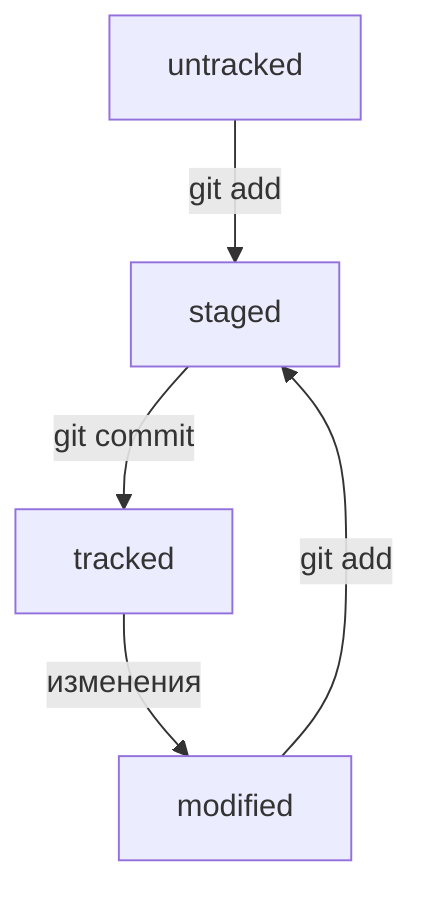

Основы работы с Git. 

Хорошее решение - пройти курс на Яндекс.Практикум. [Бесплатный курс - Основы работы с Git](https://practicum.yandex.ru/git-basics/?from=catalog)

Ниже я оставлю шпаргалку с полезной информацией и заодно сам лучше запомню ее. 

 ### Общие моменты
1. В любой непонятной ситуации ищи ответы на свои вопросы в интернете или с помощью Chat GPT
2. Конспектируй все что проходишь или по крайней мере многое.
3. Практикуйся и тестируй себя
4. Не сдавайся 

GIT - система контроля версий.  VCS  - version control system 
или SCM -  source control managment

Git и GitHub — это два разных проекта, которые развиваются независимо друг от друга.

Git: - консольный инструмент для работы с локальными и удалёнными репозиториями; - проект с открытым исходным кодом.

GitHub: - платформа для размещения удалённых репозиториев; - принадлежит компании Microsoft.

Премущества:
- Контроль -  кто что когда где зачем 
- Безопасные изменения - вытекает из первого
- Возможность восстановить - можно откатиться на старую версию, и еще и оставить проблемную в одтельном месте для испрвлений
- Командная  работа - можно одновременно вести разработку и помещать изменения сообща 

Основные функции:
- хранение истории изменений
- манипуляция историей: изменение порядка ревизий, удаление версий, возвращение назад в истории
- анализ изменений: кто, что, когда и как часто вносил

 ### Команды терминала Bash

GIT 
git version версия ГИТ. Если версия есть все хорошо, если версии нет - нужно поставить - см. Гугл )
git confing -- global user.name 123 задать имя
git confing -- global user.email 123@123.com задать почту 
git confing -- list  - посмотреть запись в конфиге
git init -  инициализация Git репозитория там где вы находитесь в тукущий момент и начнет отслеживать все изменения. Так же создаст скрытую папку git - системаная штука 
"разгитить папку" - просто удили папку .git rm -rf 
git status -  проверить состояние репозитория

`s3d0y@s3d0y-VM:~/Documents/GitCheatSheet$ git status` 
`On branch main` название текущей ветки
`Your branch is up to date with 'origin/main'.`

`Changes not staged for commit:` - изменения не на сцене
  `(use "git add <file>..." to update what will be committed)`
  `(use "git restore <file>..." to discard changes in working directory)`
	`modified:   README.md` - файлы которые менялись 

`no changes added to commit (use "git add" and/or "git commit -a")`- на комит ничего не добавлено 
`s3d0y@s3d0y-VM:~/Documents/GitCheatSheet$ ``


git add --all  добавить на сцену - подготовить к комиту. 
git commit -m 'coment'
git log - посмотреть историю комитов 
git log --oneline - сокращенный лог
git remote add - 
Откройте консоль, перейдите в каталог локального репозитория и введите команду `git remote add` (от англ. _remote_ — «удалённый» и _add_ — «добавить»).

```
$ cd ~/dev/first-project
$ git remote add origin git@github.com:%ИМЯ_АККАУНТА%/first-project.git 
```

Команде необходимо передать два параметра: имя удалённого репозитория и его URL. В качестве имени используйте слово `origin`. А URL вы скопировали со страницы удалённого репозитория.
git remote -v Флаг `-v` — короткая форма флага `--verbose` (англ. «подробный»). Он позволяет показать больше информации в выводе.
git push - толкнуть на удаленный репозиторий 
git commit --amend - работает только с последним комитом HEAD

# Шпаргалка. Базовые команды в консоли (Command Line Interface)

Чтобы вам было удобнее взаимодействовать с командной строкой, мы подготовили шпаргалку. В ней собраны все команды, о которых мы рассказали в уроках, и их полезные вариации.

### Помощь
- `man`   — manual. Совместно с именем команды выведет инструкуцию. Например `man ls` 

### Навигация

- `pwd` (от англ. _**p**rint **w**orking **d**irectory_, «показать рабочую папку») — покажи, в какой я папке;
- `ls` (от англ. _**l**i**s**t directory contents_, «отобразить содержимое директории») — покажи файлы и папки в текущей папке; 
- `ls -a` — покажи также скрытые файлы и папки, названия которых начинаются с символа `.`;
- `ls -l` —  вывод подробной информации о содержимом каталога в виде списка;
- `ls -  al` —  сразу два ключа. так тоже можно
- `cd first-project` (от англ. _**c**hange **d**irectory_, «сменить директорию») — перейди в папку `first-project`;
- `cd first-project/html` — перейди в папку `html`, которая находится в папке `first-project`;
- `cd ..` — перейди на уровень выше, в родительскую папку;
- `cd ~` — перейди в домашнюю директорию (`/Users/Username`);
- `cd /` — перейди в корневую директорию.

### Работа с файлами и папками

**Создание**

- `touch index.html` (англ. _touch,_ «коснуться») — создай файл `index.html` в текущей папке;
- `touch index.html style.css script.js` — если нужно создать сразу несколько файлов, можно напечатать их имена в одну строку через пробел;
- `mkdir second-project` (от англ. _**m**a**k**e **dir**ectory_, «создать директорию») — создай папку с именем `second-project` в текущей папке.

**Копирование и перемещение**

- `cp file.txt ~/my-dir` (от англ. _**c**o**p**y_, «копировать») — скопируй файл в другое место;
- `mv file.txt ~/my-dir` (от англ. _**m**o**v**e_, «переместить») — перемести файл или папку в другое место.

**Чтение**

- `cat file.txt` (от англ. _con**cat**enate and print_, «объединить и распечатать») — распечатай содержимое текстового файла `file.txt`.

**Удаление**

- `rm about.html` (от англ. _**r**e**m**ove_, «удалить») — удали файл `about.html`;
- `rmdir images` (от англ. _**r**e**m**ove **dir**ectory_, «удалить директорию») — удали папку `images`;
- `rm -rf second-project` (от англ. _**r**e**m**ove,_ «удалить» + _**r**ecursive_, «рекурсивный» + **f**orce, "силой/заставить/принудить" ) — удали папку `second-project` и всё, что она содержит.


### Полезные возможности

- Команды необязательно печатать и выполнять по очереди. Можно указать их списком — разделить двумя амперсандами (`&&`).
- У консоли есть собственная память — буфер с несколькими последними командами. По ним можно перемещаться с помощью клавиш со стрелками вверх (**`↑`**) и вниз (**`↓`**).
- Чтобы не вводить название файла или папки полностью, можно набрать первые символы имени и дважды нажать `Tab`. Если файл или папка есть в текущей директории, командная строка допишет путь сама.
    
    Например, вы находитесь в папке `dev`. Начните вводить `cd first` и дважды нажмите `Tab`. Если папка `first-project` есть внутри `dev`, командная строка автоматически подставит её имя. Останется только нажать `Enter`.

# SSH (шифрование)

Когда компьютеры обмениваются данными в сети, они следуют **сетевым протоколам** (англ. _network protocols_) — правилам обмена данными между компьютерами.

Один из наиболее распространённых сетевых протоколов — **SSH** (от англ. _**S**ecure **Sh**ell Protocol_). Он обеспечивает безопасный обмен данными в сети. С помощью этого протокола можно получать данные с удалённого компьютера или отправлять их на него. Трафик шифруется, поэтому протокол безопасен.

SSH использует пару ключей для обеспечения безопасности — публичный и приватный:

- **Приватный ключ** (англ. _private key_) хранится только на вашем компьютере и не должен передаваться кому-либо ещё. Он используется для расшифровки данных.
- **Публичный ключ** (англ. _public key_) доступен всем и используется для шифрования данных. Они могут быть расшифрованы парным приватным ключом.

Только вы можете расшифровать данные с помощью приватного ключа, но любой владелец публичного ключа может их для вас зашифровать. Эти два ключа связаны и образуют **SSH-пару**. В будущем вы наверняка будете использовать их для взаимодействия с GitHub и другими удалёнными серверами.

[Подробнее см в курсе](https://practicum.yandex.ru/trainer/git-basics/lesson/42435683-0922-4231-bfb4-d7d32d61f50a/)

# Markdown 

[Шпаргалка по Маркадаун](https://gist.github.com/fomvasss/8dd8cd7f88c67a4e3727f9d39224a84c)


# Хеш — идентификатор коммита
**Хеширование** (от англ. _hash_, «рубить», «крошить», «мешанина») — это способ преобразовать набор данных и получить их «отпечаток» (англ. _fingerprint_).

- если хеш получить дважды для одного и того же набора входных данных, то результат будет гарантированно одинаковый;
- если хоть что-то в исходных данных поменяется (хотя бы один символ), то хеш тоже изменится (причём сильно).

Git хранит таблицу соответствий `хеш → информация о коммите`. Если вы знаете хеш, вы можете узнать всё остальное: автора и дату коммита и содержимое закоммиченных файлов. Можно сказать, что хеш — основной идентификатор коммита.

При работе с Git хеши будут встречаться вам регулярно. Их можно будет передавать в качестве параметра разным Git-командам, чтобы указать, с каким коммитом нужно произвести то или иное действие.

Все хеши и таблицу `хеш → информация о коммите` Git сохраняет в служебные файлы. Они находятся в скрытой папке `.git` в репозитории проекта.

# Файл HEAD

Файл `HEAD` (англ. «голова», «головной») — один из служебных файлов папки `.git`. Он указывает на коммит, который сделан последним (то есть на самый новый).

В этом можно убедиться с помощью терминала. Перейдите в папку `.git` командой `cd`. Посмотрите содержимое файла `HEAD` командой `cat`.
Внутри `HEAD` — ссылка на служебный файл: `refs/heads/master` (или `refs/heads/main` в зависимости от названия ветки). Если заглянуть в этот файл, можно увидеть хеш последнего коммита.

Когда вы делаете коммит, Git обновляет `refs/heads/master` — записывает в него хеш последнего коммита. Получается, что `HEAD` тоже обновляется, так как ссылается на `refs/heads/master`.

`HEAD` Синоним последнего комита - при работе с Git указатель `HEAD` используется довольно часто. Команды Git принимают в качестве параметра хеш коммита. Если нужно передать последний коммит, то вместо его хеша можно просто написать слово `HEAD` — Git поймёт, что вы имели в виду последний коммит.

# Статусы файлов в Git

-  `untracked` - новые файлы в Git-репозитории помечаются как `untracked`, то есть неотслеживаемые. Git «видит», что такой файл существует, но не следит за изменениями в нём. У `untracked`-файла нет предыдущих версий, зафиксированных в коммитах или через команду `git add`

-  `tracked`- Состояние `tracked` — это противоположность `untracked`. Оно довольно широкое по смыслу: в него попадают файлы, которые уже были зафиксированы с помощью `git commit`, а также файлы, которые были добавлены в staging area командой `git add`. То есть все файлы, в которых Git так или иначе отслеживает изменения.
  
- `staged` - После выполнения команды `git add` файл попадает в **staging area**, то есть в список файлов, которые войдут в коммит. В этот момент файл находится в состоянии `staged`. В одном из предыдущих уроков мы сравнили коммит с фотографией. Можно развить эту аналогию и сказать, что команда `git add` добавляет персонажей (текущее содержимое файла или нескольких файлов) на **сцену** (англ. _stage_) для общей фотографии, а `git commit` делает снимок всей сцены целиком.

 - `modified` -  `modified` означает, что Git сравнил содержимое файла с последней сохранённой версией и нашёл отличия. Например, файл был закоммичен и после этого изменён.
# Формат описания схем Mermaid


  С языком разметки [Mermaid](https://habr.com/ru/articles/652867/) можно делать любые диграммы! Это очень круто!


Примеры (+ комментарии ):


